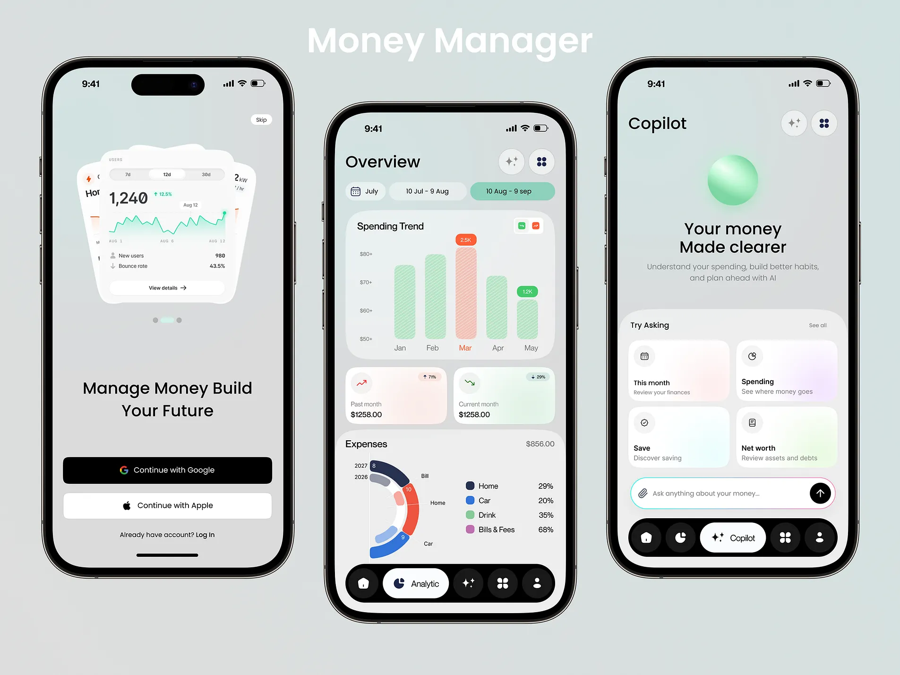

# Catálogo de referências

## F01 — Balance Finance App UIKit, Figma Light

[Arquivo fornecido pelo usuário](https://www.figma.com/design/ZRrsaOE0anDeT1zZncBgUe/Balance?node-id=0-1), acesso confirmado em08/10/2026. Contexto/render de My balance `1:17` e Analytics `1:2353` consultados. Observados saldo/ações/barras na primeira e totais/anel na segunda, com fundos claros/lilás e formas arredondadas.

Uso autorizado: **piloto da inicial e comparação de gráficos**, adaptados a Jade/Manrope e consulta real do ez finance. Composição final ainda em validação. Não aprova transferências, contatos, câmbio, patrimônio, notificações ou saúde financeira. Sem assets copiados; autoria/licença de redistribuição não verificadas. [Registro do piloto](../validacoes/008-piloto-overview-figma.md).

Inspeção das dez imagens locais em **08/10/2026**. Produto identificado na marca das capturas: **Buddy**; coleção nomeada **iOS Onboarding**; fonte indicada nas imagens: **Mobbin**. Link direto do fluxo, versão do aplicativo e data de coleta: **a fornecer**. Registrar aqui, sem duplicar as imagens.

**Orientação aprovada em 08/10/2026:** o fluxo do Mobbin não corresponde à proposta do aplicativo. Usar as imagens apenas como inspiração estética para figuras, ícones, tipografia, cores e tratamentos visuais. Não adotar o fluxo, a arquitetura de telas ou a identidade integral do Buddy. Phosphor é a biblioteca de ícones escolhida e Manrope é a fonte aprovada; as cores do Ez Finance continuam em aberto.

## Sequência

### Referência complementar M01 — entrada e overview

- **Arquivo:** `docs/design/referencias/01-money-manager-auth-overview.webp`.
- **Nome recebido:** `044a7b5a535ae27eb8240fe674078e50.webp`; movido de `docs/design/` sem modificar pixels ou criar cópia, em 08/10/2026.
- **Identificação:** título visível “Money Manager”; não confirma nome de aplicativo publicado, autor ou implementação real. Origem/link/licença da composição: **não informados**. Não classificar como export do Mobbin.
- **Uso solicitado pelo usuário:** incluir como inspiração para login/cadastro e overview. Essa intenção está aprovada; valores de paleta, layout final e funcionalidades visíveis não foram aprovados automaticamente.
- **Ordem de leitura:** M01-A = aparelho esquerdo (entrada); M01-B = centro (overview); M01-C = direita (assistente). São regiões de uma composição única, não etapas comprovadas de um fluxo.

**Observado na imagem:** fundo claro entre cinza e menta, superfícies brancas arredondadas, texto escuro, botões circulares, ação de entrada preta, acentos menta/coral e alguns fundos com variação suave de cor. Há ilustração de cards empilhados na entrada, controles de período, gráficos, resumos e barra inferior escura no overview. O aparelho direito apresenta assistente de IA. Família tipográfica, biblioteca dos símbolos e valores exatos não foram identificados.

**Viabilidade de adaptação:**

| Área | Adaptação recomendada, ainda proposta | Limites |
| --- | --- | --- |
| Login | Composição de boas-vindas compacta, fundo suave, Google em destaque e alternativa email/senha; incorporar Manrope e Phosphor já aprovadas. | Não trazer Apple, “Skip” ou acesso sem sessão. Ilustração deve ser própria/autorizada e secundária; não recortar os cards da imagem. |
| Cadastro | Repetir linguagem visual, hierarquia e controles da entrada, com campos, confirmação e mensagens reais. | A captura não contém formulário de cadastro; sua estrutura é proposta a partir do fluxo existente. Não esconder campos/erros para copiar a composição. |
| Overview | Cabeçalho de período, resumo de receitas/despesas/saldo, lista e filtro por categoria quando a etapa funcional estiver pronta. | A consulta atual é de todo o histórico; controles mensais continuam vinculados à etapa 6. Saldo é da consulta, não patrimônio ou saldo bancário. |
| Cards e navegação | Superfícies claras, alinhamento de números e seleção bem sinalizada. Comparar barra inferior somente com destinos reais. | Não criar cinco destinos para preencher o desenho; manter teclado, rótulos e áreas de toque. |
| Gráficos/assistente | Servem para observar composição e contraste, não para implementação na V1. | Gráficos, IA, metas, tendências/comparações percentuais e patrimônio não entram por inferência. Não copiar métricas ilustrativas. |

**Cuidados no piloto:** texto auxiliar muito claro na referência deve ter contraste medido; não copiar esse tratamento sem avaliação. Conteúdo rolável, foco/teclado e estados vazio/erro/carregamento não são demonstrados pela imagem. Testar composição em mobile e web ampla; botões e barra inferior não podem cobrir campos ou conteúdo. Começar por superfícies sólidas antes de decidir gradientes/blur, que não são necessários para obter essa hierarquia.

**Recomendação:** usar M01 como referência de composição mais próxima para o piloto e manter Buddy como apoio estético. Solicitar link/autoria, se disponíveis, para completar procedência; isso não bloqueia uma interpretação própria, sem reutilizar assets da composição.

### Coleção Buddy B00–B09

A ordem abaixo segue os sufixos numéricos dos arquivos fornecidos. Ela organiza a leitura; não prova que estes são todos os passos obrigatórios do fluxo original. Os nomes originais foram preservados.

| ID | Arquivo | Conteúdo visível |
| --- | --- | --- |
| B00 | [Buddy iOS Onboarding 0.png](mobbin/Buddy%20iOS%20Onboarding%200.png) | Splash roxo, nome Buddy e padrão de símbolos. |
| B01 | [Buddy iOS Onboarding 1.png](mobbin/Buddy%20iOS%20Onboarding%201.png) | Boas-vindas creme, imagem amarela, ação principal escura, entrada anônima e acesso de membro. |
| B02 | [Buddy iOS Onboarding 2.png](mobbin/Buddy%20iOS%20Onboarding%202.png) | Sheet do sistema para login Apple sobre a tela inicial. |
| B03 | [Buddy iOS Onboarding 3.png](mobbin/Buddy%20iOS%20Onboarding%203.png) | Grade de seis interesses, cards brancos e ícones em superfícies coloridas suaves. |
| B04 | [Buddy iOS Onboarding 4.png](mobbin/Buddy%20iOS%20Onboarding%204.png) | Mesma grade com três opções realçadas; diferença entre selecionado e não selecionado. |
| B05 | [Buddy iOS Onboarding 5.png](mobbin/Buddy%20iOS%20Onboarding%205.png) | Explicação de notificações; card com dois switches, sino amarelo e CTA escuro. |
| B06 | [Buddy iOS Onboarding 6.png](mobbin/Buddy%20iOS%20Onboarding%206.png) | Permissão nativa iOS sobre a tela anterior. |
| B07 | [Buddy iOS Onboarding 7.png](mobbin/Buddy%20iOS%20Onboarding%207.png) | Oferta de período gratuito, fundo roxo, card de cronologia, preço e CTA roxo. |
| B08 | [Buddy iOS Onboarding 8.png](mobbin/Buddy%20iOS%20Onboarding%208.png) | Continuação da oferta: prova social, perguntas recolhidas, contato e ações inferiores. |
| B09 | [Buddy iOS Onboarding 9.png](mobbin/Buddy%20iOS%20Onboarding%209.png) | Pergunta expandida, texto longo, restauração de compras e ações da oferta. |

Novas coleções: colocar em `docs/design/mobbin/<produto>-<fluxo>/`, com prefixo `01-`, `02-` etc. Acrescentar linhas com ID, caminho, origem, propósito e estado mostrado. Não renomear/duplicar a coleção atual apenas por padronização.

## Padrões observados

- **Hierarquia:** títulos grandes e pesados, explicação secundária mais leve e uma ação inferior dominante (B01, B03–B05). Não foi identificada a família exata da fonte pela imagem.
- **Superfícies:** fundos claros próximos de creme/lilás, cards brancos, cantos bastante arredondados e sombras suaves (B01, B03–B05, B08–B09). Medidas exatas e cores hexadecimais não foram extraídas nem aprovadas.
- **Cor:** roxo intenso aparece em marca/oferta; preto em CTAs de onboarding; amarelo, coral, azul, turquesa e rosa em imagens/seleção. Isso não prova uma única cor de ação para toda a aplicação.
- **Densidade:** onboarding espaçoso com grandes áreas de ilustração, escolhas agrupadas em duas colunas e CTA separado do conteúdo.
- **Ícones:** ilustrações/símbolos preenchidos em suportes arredondados; B04 realça itens selecionados com cor e contraste. Não é possível determinar a biblioteca ou licença pelos pixels.
- **Interação visível:** comparação B03/B04 para seleção e B08/B09 para expansão. Capturas estáticas não comprovam hover, foco, animação, teclado, contraste adequado ou comportamento responsivo.
- B02/B06 são interface do sistema iOS, não componentes próprios a reproduzir no Expo Web/Android. Barra de status, indicador inferior e faixa Mobbin não pertencem à tela do Ez Finance.

## Possibilidades de adaptação, ainda não aprovadas individualmente

| Observação | Uso possível no Ez Finance | Limite de escopo |
| --- | --- | --- |
| Uma ação dominante e hierarquia clara | Google como entrada principal; email/senha como alternativa legível, conforme requisitos existentes. | Não criar login Apple ou modo anônimo. |
| Superfícies suaves e cantos arredondados | Campos e grupos de informações com acolhimento e leitura fácil. | Não copiar todos os raios/sombras sem testar densidade financeira. |
| Escolhas com texto e cor | Categoria/tipo claramente selecionado, com texto e sem depender só de cor. | Categorias continuam fixas; grade de interesses não é um novo onboarding obrigatório. |
| Texto longo em expansão | Organizar explicações quando necessário, preservando leitura e teclado. | Não acrescentar FAQ comercial, oferta, planos ou paywall. |
| Ênfase cromática e ilustração | Propor uma identidade própria com cor de ação e semântica financeira separadas. | Roxo, fonte e ilustrações do Buddy não estão aprovados; não extrair assets de screenshots. |

Não incorporar orçamento, objetivos, colaboração, notificações, assinatura, avaliações comerciais ou sincronização offline a partir dessas imagens. O escopo continua no contexto/plano.

## Informações a completar pelo usuário

- Link direto do fluxo no Mobbin: **pendente**.
- Data da coleta/versão, se disponível: **pendente**.
- Capturas prioritárias (IDs B00–B09) e partes que deseja evitar: **pendente**.
- Grau de aproximação: **confirmado** — inspiração estética, sem reproduzir o fluxo do Buddy. Escolhas concretas de fonte, cores, figuras e tratamentos permanecem pendentes.
- Referências complementares de lista/formulário financeiro: **opcionais para depois**.
