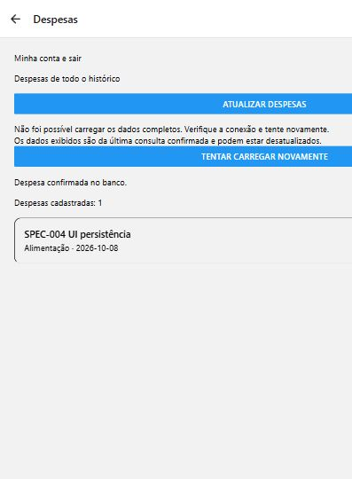
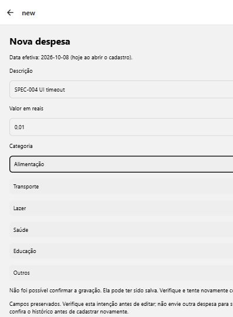
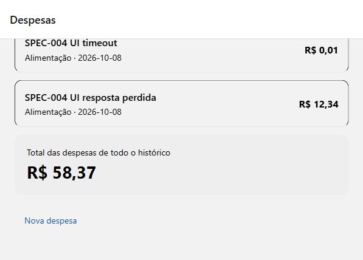

# SPEC-004 — Evidências de persistência financeira

**08/10/2026 — concluída no recorte web local.** P01–P15 atendidos pelos métodos descritos abaixo. Não equivale à V1 completa, homologação hospedada, backup operacional ou APK. [Spec](../specs/004-persistencia-financeira.md), [contexto](../CONTEXTO_APP.md) e [plano](../PLANO_IMPLEMENTACAO.md).

## Entrega e ambiente

Reutilizados domínio financeiro, catálogo, cliente público compartilhado e estado validado da SPEC-003. SDK instalado `@supabase/supabase-js` 2.117.3; CLI 2.120.0; API local `127.0.0.1:54321`, PostgreSQL Docker e web principal `localhost:8081`. Nenhuma dependência nova.

- `src/lib/transactions/{repository,controller,errors}.ts`: CRUD, categorias, leitura por ID, filtros, consultas completas, reconciliação e estado isolado.
- `src/contexts/ExpensesContext.tsx`, layout raiz, cadastro/lista/cards: integração mínima de despesas; provider estável preserva rascunho privado em indisponibilidade transitória, sem contornar guard.
- `supabase/migrations/20261008000100_transaction_intent_id.sql`: **migration nova aplicada por `migration up --local`, sem reset**. Somente grant de insert de `id` para authenticated. Dono padrão, PK, RLS, constraints, grants restantes e identidade imutável preservados; migration da fundação não editada.
- `tests/transactions{,.integration}.cjs`, `supabase/tests/004_transaction_intent.test.sql`, scripts/package/tsconfig de testes: unidade, SDK/Auth/API reais e dez verificações SQL adicionais.

Receitas/edição/exclusão/filtros completos só na camada de dados. Não foram criados seus controles de produto, diagnósticos permanentes, importação de memória ou fila offline. Rota de detalhes permanece vazia; exportação ainda informa esse aviso preexistente.

## Estratégia de repetição segura

UUID gerado internamente **uma vez por intenção**, separado do DTO editável. Antes do insert/retry, consulta desse ID sob JWT/RLS da mesma identidade. Linha acessível com os mesmos campos normalizados confirma; conteúdo divergente ou PK inacessível geram conflito. Não há upsert nem sobrescrita silenciosa.

Cada requisição fixa explicitamente o JWT obtido do **mesmo cliente SDK** para o proprietário já validado, conferindo novamente a geração antes de enviar. Isso não valida uma sessão somente pela leitura local nem cria armazenamento/cliente paralelo: sem escopo Auth validado, não há operação. Evita que a resolução assíncrona de token do SDK atribua um rascunho A à nova sessão B.

Após resultado incerto, campos e UUID ficam em memória, edição bloqueada e retry explícito verifica antes de reemitir. Duplo envio compartilha a promessa; mutações do mesmo ID são serializadas. Atualização verifica linha afetada e reconcilia conteúdo; exclusão somente reconcilia ausência quando já conhecia a linha/operação autorizada. ID ausente arbitrário não vira confirmação fabricada. Logout/troca/recuperação limpam memória de operações e estado financeiro; respostas obsoletas não repovoam outra identidade.

Consulta por cursor descendente `(occurred_on,id)`, páginas técnicas de 200, termina somente em página **vazia**, mesmo se gateway entregar página menor. Totais em centavos sobre o conjunto completo. Leitura parcial falha integralmente, preservando a última consulta completa da mesma conta com aviso. Não promete snapshot entre requisições: mudanças externas podem exigir nova consulta; ausência de Realtime/travas entre dispositivos é limite desta etapa.

## Matriz P01–P15

| Caso | Resultado e evidência |
| --- | --- |
| P01 | **Passou.** Duas contas descartáveis com JWT real; catálogo dez IDs conferido; B não lê linha A, ID ausente/inacessível equivale a null. Anon recebe 42501. Estado desconectado/recuperação não concede escopo financeiro, mesmo com JWT no SDK; unidades/controller e regressão real de Auth complementam API/RLS. |
| P02 | **Passou.** Repositório real cria receita/despesa, lê, altera campos editáveis, confere valor diretamente pela API e exclui. ID, dono e criação preservados; atualização/exclusão inacessíveis rejeitadas. |
| P03 | **Passou.** Domínio e API/banco rejeitam zero, excesso de limite/casas, categoria incompatível, descrição vazia, data inexistente/futura. Formulário real rejeitou `35,901`, preservou campos e aceitou `35,90`; sem arredondamento silencioso. |
| P04 | **Passou.** Receita 10000 + despesa 3590 → saldo 6410; categoria só despesa → -3590. Fevereiro bissexto inclui 29/02, exclui 01/03; filtros/dono aplicados ao mesmo conjunto. Precisão/limites de soma cobertos no domínio. |
| P05 | **Passou.** 1.007 linhas de um centavo sob JWT da fixture. API simples retorna 1.000; repositório retorna 1.007 IDs distintos e total 1007, sem aumentar max_rows. Falha de rede na segunda página, mantida durante retries GET, rejeita resultado completo. Unidade também verifica página curta e falha parcial. |
| P06 | **Passou.** Cadastro real → card/lista → reload → logout/login A → reinício `supabase_db_ez-finance` → reload. Seis despesas UI, total R$ 58,37, IDs/campos/donos iguais; comparação antes/depois de sete linhas completas inclui fixture humana R$ 12,34. Container voltou healthy. Volume preservado, sem reset. |
| P07 | **Passou.** POST real retorna sucesso do serviço depois de commit; wrapper consome a resposta e a descarta. API independente comprova uma linha; retry retorna mesmo ID sem segundo POST. Divergência não sobrescreve; UUID de A usado por B não revela/confirma linha. Também comprovado no navegador com timeout do corpo HTTP após commit real e reconciliação explícita. |
| P08 | **Passou.** Dois creates reais concorrentes com mesma intenção retornam mesmo ID e uma linha. Formulário bloqueia duplo envio/edição. Unidades exercitam conclusão tardia de leitura/create/update/delete depois de A→B/logout e bloqueio durante releitura, sem aplicar estado antigo. Prova adicional real troca a sessão SDK A→B durante resolução do token do POST: commit pertence a A, B não lê a linha e resposta tardia é stale; tokens vêm de Auth real, não fabricados. |
| P09 | **Passou.** API real inacessível/falha após primeira página. Navegador manteve card R$ 35,90 e total, exibiu aviso de última consulta e retry; conexão restaurada recuperou leitura. Nenhuma lista parcial/zero de erro apresentado como resultado confirmado. |
| P10 | **Passou.** Antes de commit: conexão real falha e linha ausente; retry cria uma. Depois de commit: linha existe e resposta perdida, retry reconcilia uma. PATCH/DELETE reais também têm resposta perdida depois de commit e não repetem mutação ao reconciliar. Na UI, antes do commit preservou descrição/valor/categoria/data; depois do commit bloqueou edição e ofereceu verificar. Commit confirmado seguido de falha GET navegou com mensagem separada e último total sinalizado; recuperação da consulta remove aviso obsoleto. O cliente não presume ausência de commit apenas por erro de rede. |
| P11 | **Passou.** Refresh Auth real preserva proprietário; JWT inválido enviado à API real aciona revalidação do repositório. Auth/regressões cobrem sessão inválida/recuperação/renovação. Navegador A→logout→B mostra zero confirmado sem históricos A; retorno A recupera seis registros. Gerações e guard impedem respostas/dados privados obsoletos. |
| P12 | **Passou.** API real impede criar em nome de outro dono, editar/remover B e alterar ID/dono/criação. SQL repetido com novo grant confirma identidade imutável, UUID único, RLS e isolamento; nenhuma chave administrativa no aplicativo. |
| P13 | **Passou.** Cadastro/lista/cards usam Transaction, IDs, centavos e BRL; catálogo autenticado, feedback web e data hoje. Botão fictício removido. Falhas preservam intenção/campos; sucesso só após confirmação. Corrigidos título do cadastro, mensagem de releitura obsoleta e colapso visual da lista após reload; lista/total roláveis conferidos no navegador. |
| P14 | **Passou com intervenção humana externa.** Usuário criou `SPEC-004 vínculo web`, R$ 12,34/Alimentação, confirmou presença depois de logout/reentrada e explicitamente confirmou **Google e email/senha** como a mesma conta original. API conferiu uma linha sob o dono registrado; identidade Auth/identidades vinculadas preservadas na baseline. Prova não usa simulação de Google. |
| P15 | **Passou.** 37 testes normais; 38 com integração financeira; 38 com integração Auth; tipos, exportação web e 63 SQL. Limpeza restrita às fixtures conhecidas, contas humanas/baseline conferidas. Scan de segredos locais conhecidos e bundle financeiro concluído sem exposição. Ferramentas temporárias de prova fora do app e encerradas ao concluir. |

## Provas web e correções

Web principal 8081 usada pelo humano nos dois métodos. Para falhas controladas, instância **do mesmo código de aplicativo** em 8082 e transporte HTTP de loopback separado, restrito a duas contas descartáveis. `.env.local`, provider Google, allowlist Auth, segurança e servidor principal não foram alterados. Transporte encaminha SDK/Auth/REST ao serviço real e nunca fabrica linha/sucesso de banco.

1. Entrada pela tela com credenciais existentes de fixture; catálogo real e histórico vazio confirmado.
2. Valor com três casas rejeitado; correção para R$ 35,90 persistiu e retornou card/total.
3. Indisponibilidade GET manteve último histórico, erro explícito e retry.
4. Primeiras interrupções TCP após commit fizeram o navegador repetir o POST; PK gerou 409 e o repositório reconciliou a linha. Essa repetição de transporte **não foi tratada como prova de estado incerto do formulário**.
5. Prova definitiva pós-commit: upstream 201 consumido; cabeçalhos/corpo incompleto entregues sem terminar, AbortController expirou após 15s. Uma linha real de R$ 0,01; campos bloqueados/UUID preservado, mensagem incerta e retry explícito. Antes/depois do retry, contadores mantiveram **1 POST / 1 commit**. Após retry, total R$ 56,14 sem duplicar linha.
6. Falha anterior ao encaminhamento: banco continuou com quatro linhas; formulário incerto, retry com mesma intenção criou R$ 1,00 uma vez. A ausência de commit foi comprovada pela prova de serviço, não inferida pelo aplicativo.
7. POST R$ 1,23 confirmado seguido de GET indisponível: banco seis linhas, UI último conjunto cinco/R$ 57,14 com mensagens separadas. Retry restaurou seis/R$ 58,37. Corrigido aviso de falha remanescente após recuperação.
8. Reload/sessão e A→B→A; reinício apenas do PostgreSQL com volume; comparação exata e releitura autenticada. Inspeção visual encontrou altura zero da lista apesar dos cards no DOM; corrigida usando a FlatList como área de rolagem da tela, com cabeçalho/rodapé. Cards e total acessíveis após reload.







## Reprodução e resultados

```powershell
npx --yes supabase@2.120.0 migration up --local
npm test
npm run test:finance
npm run test:auth
npm run typecheck
npx --yes supabase@2.120.0 test db
npm run build:web
```

Finance/Auth são opt-in e restritos à stack local. Admin somente no processo Node local de preparação/limpeza; gravações financeiras de integração usam cliente público/JWT. Contas/senhas/tokens/IDs privados não constam neste registro. Tests SQL usam rollback. `git diff --check` aprovado; arquivos novos também conferidos, sem sobrescrever mudanças existentes.

O teste financeiro inicialmente falhou porque o SDK reexecutava GET depois de uma única perda de resposta. Ajustada a **prova**, mantendo indisponibilidade durante retries e verificando falha integral; comportamento automático do SDK não foi confundido com consulta parcial aprovada. Transporte temporário também teve cabeçalhos CORS/codificação corrigidos; falhas de infraestrutura da prova não atribuídas ao produto.

## Preservação, limpeza e limites

Suíte financeira limpa IDs/donos conhecidos em finally e remove somente suas duas contas fictícias por execução. Na UI, seis linhas identificadas e duas contas descartáveis; uma fixture humana expressamente solicitada como descartável, registrada com ID/dono/descrição/valor antes da limpeza. Conferência compara identidades humanas e todas as linhas originais antes/depois. Nenhuma alteração de senha/vínculo/exclusão de conta humana, reset, importação experimental, descarte de volume ou redução de RLS.

**Limpeza executada:** seis linhas UI + uma fixture humana removidas pelos IDs/donos registrados; duas contas UI descartáveis removidas. Identidades das duas contas humanas e todos os outros lançamentos permaneceram iguais à baseline. Arquivo privado de credenciais das fixtures removido; transporte/Metro 8082 encerrados, servidor principal 8081 preservado e HTTP 200 conferido em localhost. Leitura final confirmou duas contas humanas, zero contas SPEC-004 e zero lançamentos humanos após retirar a única fixture presente na baseline; nenhuma coleção original foi apagada.

Scan final: 32 artefatos exportados e seis logs locais, zero ocorrências dos segredos Google/admin conhecidos, zero código administrativo na camada financeira do app e nenhuma URL do transporte de teste no export. Senhas de fixture também foram conferidas antes de remover o arquivo privado. Isso é uma conferência de segredos conhecidos, não certificação universal de segurança.

Sem pendência obrigatória da SPEC-004. Etapas 5–6 ainda precisam completar receitas/edição/exclusão/descarte, data selecionável, filtros mensais/categoria e indicadores finais. Hospedado/backup/restauração, avaliação externa e Android/aparelho/APK permanecem posteriores. Não há fila offline, recuperação persistente de intenção/rascunho, snapshot multi-request nem resolução de concorrência entre dispositivos.

## Revisão independente para avançar — 08/10/2026

Repositório/controller financeiros, provider, cadastro/lista/card, migration incremental e evidências conferidos contra o recorte da SPEC-004. Reproduzidos `npm test` (37 aprovados), `npm run typecheck` (saída 0), `npm run test:finance` (38 aprovados) e `npx --offline --yes supabase@2.120.0 test db` (63 aprovados). A suíte financeira real confirmou 1.007 registros, CRUD/isolamento, falhas/reconciliação depois de commits POST/PATCH/DELETE e troca de sessão durante resolução do JWT; fixtures da execução limpas pelo teste.

Nenhum bloqueador identificado nesta revisão para planejar a etapa 5. Não houve alteração do código/configuração, reset, reinício ou login Google nesta revisão. Provas visuais no navegador, métodos vinculados com intervenção humana, durabilidade após reinício e exportação permanecem evidências da entrega anterior, sem nova reprodução. A integração exigiu execução autorizada fora do sandbox para Docker/rede local; contas/dados humanos não foram usados como fixtures.

Próxima entrega planejada: [SPEC-005 — Formulários e proteção das alterações](../specs/005-formularios-e-protecao-de-alteracoes.md). Amplia a interface para receitas/despesas, edição/data/exclusão/descarte; consulta mensal/filtros ficam para etapa 6. Nesta passagem foram alterados somente documentos.
